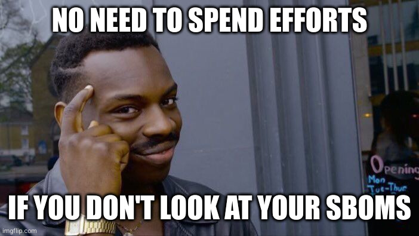

A: SBOMs können einen Mehrwert bieten, sie sind bloß schlicht nicht die Silver Bullet, die viele sich erhoffen.

C: Aber wofür brauchen wir die denn dann?

---

| **Regulation**           | **Industry**                     |
|--------------------------|----------------------------------|
| NIS-2 Directive          | Critical Infrastructure          |
| EU Cyber Resilience Act  | "Products with digital Elements" |
| DORA                     | Financial Sector                 |
| US Executive Order 14028 | US Government Software Suppliers |
| FDA                      | Medical Devices                  |
| UNECE R 155 WP.29        | Automotive (self-driving cars)   |

Notes:

A: Allein schon, weil sie direkt oder indirekt in einigen neuen Cybersecurity Regularien abgebildet werden.

C: Also müssen wir das in unserem Kontext sowieso machen

---

Notes:

A: Ja, aber lassen Sie uns das nicht als Compliance-Checkbox betrachten, sondern was sinnvolles damit anstellen.

C: Wie soll dass jetzt funktionieren? All meine Ideen haben sie auseinandergenommen...

A: In der Software Entwicklung ist ein Thema von vitaler Wichtigkeit: Abhängigkeiten tracken! Das macht man in Bezug auf Open Source Packages mit einer sogenannten "Software Composition Analysis".

C: Was bringt mir das?

A: Naja mit der Software Composition Analysis wird die Applikation nach externen Abhängigkeiten durchsucht und überprüft, ob die Komponenten aktuell sind, Schwachstellen enthalten und gegebenenfalls problematische Lizenzen beinhalten. Hier, schauen Sie mal; so sieht das zum Beispiel im OWASP Dependency Tracker aus

---

<<Screenshot Dependency Tracker>>

Notes:

C: Gekauft!

A: Open Source!

---

Notes:

C: Das klingt aber nach nichts Neuem...

A: Ist es auch nicht, durch die Einführung von SBOMs ist dieses Thema wieder in den Vordergrund getreten und um kommerzielle Komponenten erweitert worden. Die Notwendigkeit einer ordentlichen Inventarisierung von Software gibt es aber schon seit einiger Zeit.
